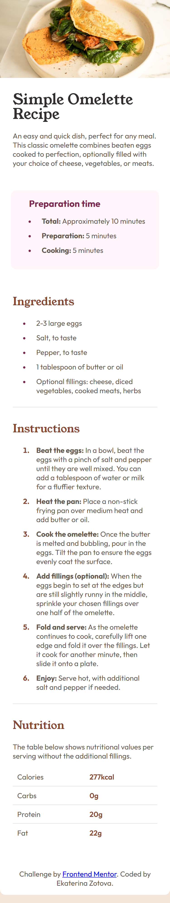
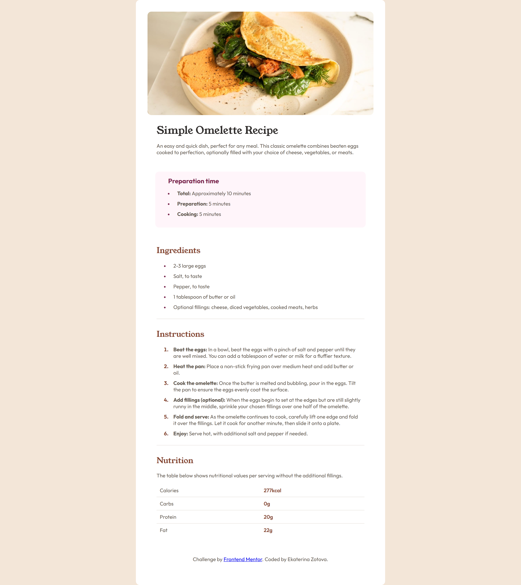

# Frontend Mentor - Recipe page solution

This is a solution to the [Recipe page challenge on Frontend Mentor](https://www.frontendmentor.io/challenges/recipe-page-KiTsR8QQKm). Frontend Mentor challenges help you improve your coding skills by building realistic projects. 

## Table of contents

- [Overview](#overview)
  - [The challenge](#the-challenge)
  - [Screenshot](#screenshot)
  - [Links](#links)
- [My process](#my-process)
  - [Built with](#built-with)
  - [What I learned](#what-i-learned)
  - [Continued development](#continued-development)
  - [Useful resources](#useful-resources)
  - [AI Collaboration](#ai-collaboration)
- [Author](#author)
- [Acknowledgments](#acknowledgments)

**Note: Delete this note and update the table of contents based on what sections you keep.**

## Overview

### The challenge

The goal of this challenge was to build a responsive recipe page based on a provided design. The layout includes:

- A hero image
- A recipe description
- Preparation time section
- Ingredients list
- Step-by-step instructions
- Nutrition information table
- The main focus was on semantic HTML structure and accurate styling using CSS.

### Screenshot

- Mobile first version: 
- Desktop version: 

### Links

- Live Site URL: [https://zookatt.github.io/recipe-page/](https://zookatt.github.io/recipe-page/)

## My process

### Built with

- Semantic HTML5 markup
- CSS custom properties
- Flexbox
- CSS Grid
- Mobile-first workflow

### What I learned

During this project, I reinforced the importance of writing clean semantic HTML and structuring content properly using sections, lists, and description lists.

I also practiced:

- Using CSS custom properties to keep colors consistent
- Building layouts with a mobile-first approach
- Creating a simple table layout using CSS Grid
- Styling list markers differently for ordered and unordered lists

